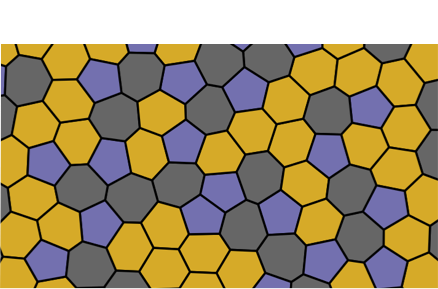

# Vertex Model



A repository containing the structure for the `vertexmodelpy` package, along with examples and galleries.


## Introduction

The `vertexmodelpy` module is a pure Python implementation of the vertex model originally introduced by [Farhadifar et al.](https://www.sciencedirect.com/science/article/pii/S0960982207023342). This model is commonly used to simulate the mechanics of epithelia. Currently, this implementation supports tissue packings with open and free-to-deform boundaries. Future releases might include periodic boundary conditions (PBC) and the ability to simulate shear stress.

## Installation

To install the package, follow these steps:

1. Ensure you have `pyenv` and `python 3.8.18` installed.
2. Clone the repository:
    ```sh
    git clone https://github.com/carlosmduque/vertex-model-python.git
    cd vertex-model-python
    ```

3. Set up a virtual environment and install dependencies:
    ```sh
    pyenv local 3.8.18
    python -m venv .venv
    source .venv/bin/activate
    pip install --upgrade pip
    pip install -r requirements.txt
    pip install .
    ```

<!-- ## Requirements

The following Python packages are required and will be installed from `requirements.txt`:
- `numpy==1.21.0`
- `scipy==1.7.3`
- `pandas==1.5.3` -->

## Acknowledgements

`vertexmodelpy` is written by Carlos Duque.

For more information and detailed usage examples, please refer to the documentation and examples provided in the repository.

## TODO

Add unit testing capabilities.